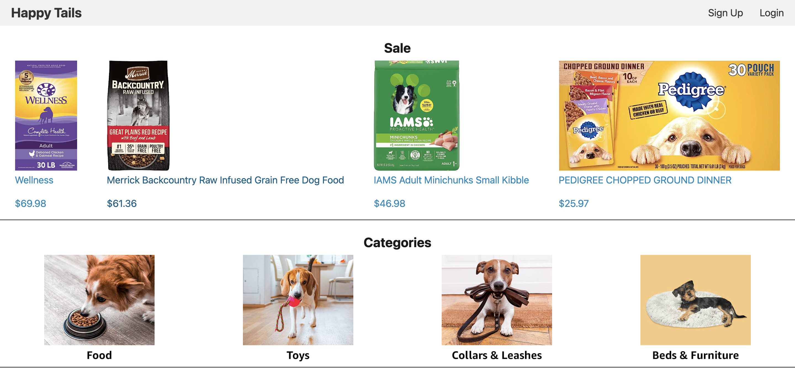
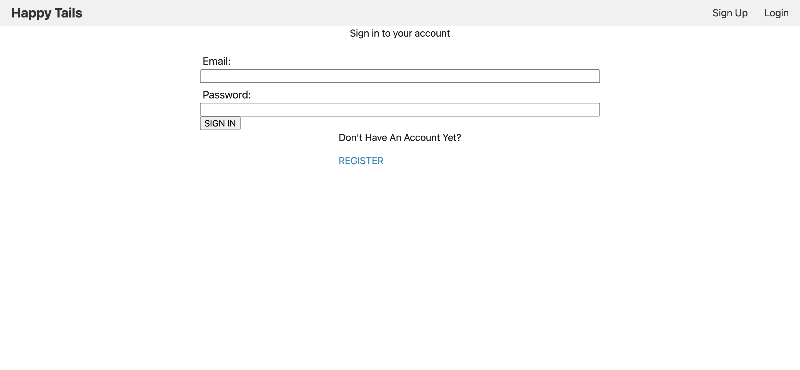

#  Happy Tails Pet Supply Store
  ## Licensing: MIT 

  ## Description
  Our website is designed for people who love to shop online for pet supplies for their domestic pets. Customers can choose products by category, on sale status, or new arrival status. Customers are able to create an account and have the option to login and logout. Customers are also able to add or subtract items from their shopping cart.
  
  Elevator Pitch: Does your pet need a new bed or a new toy? Do you want to save time by ordering everything you need for your furry friend from the comfort of home? Well look no further because this website was designed specifically for that! Users are provided categories to help guide them in the right direction. Users can also see items that are on sale, with user-friendly navigation.

  ## Table of Contents
  
  -[Installation](#installation)
  -[Usage](#usage)
  -[Credits](#credits)
  -[License](#license)  
  -[Tech used](#tech-used)
  -[Questions](#questions)

  ## Website Preview
  
  
  

  ## Links
  - Github repo: https://github.com/cverges1/e-commerce-store
  - Heroku URL: 

  ## Usage
  Users will only need a machine with connection to the internet and a list of supplies they might need for their furry friend.

  ## Tech used
* JavaScript
* Node.JS
* Google Analytics
* HTML
* CSS
* Handlebars
* SQL

## Credits
Collaborators:
* Chris Verges (Github: <a href="https://github.com/cverges1" target="_blank">cverges1 </a>)
* Connor Grogan (Github: <a href="https://github.com/connorg45" target="_blank">connorg45 </a>)
* Abelardo Lugo  (Github: <a href="https://github.com/alugo0823" target="_blank">alugo0823</a>)

## Questions
Have any questions or concerns? Here is where you can reach us:
Email addresses: 
* lugo.kse23@gmail.com (Abelardo Lugo)
* 99grogan@gmail.com (Connor Grogan)
* vergeschris@gmail.com (Chris Verges)